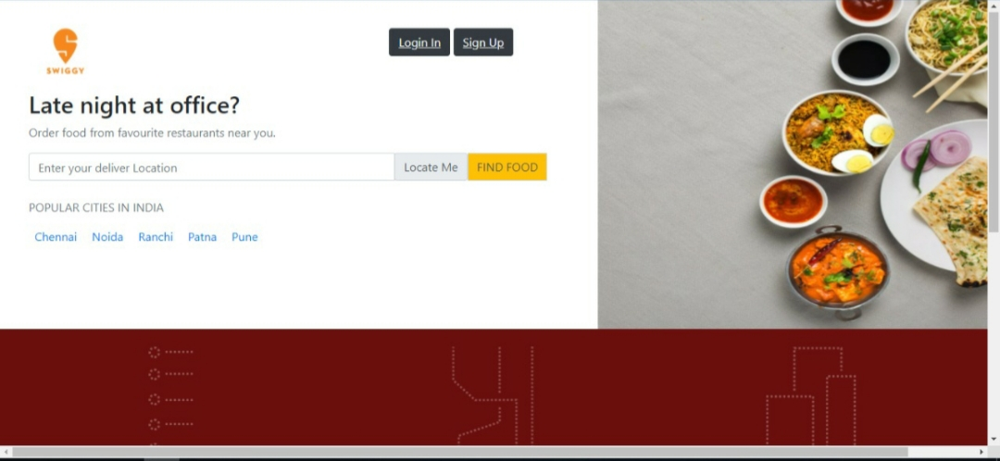
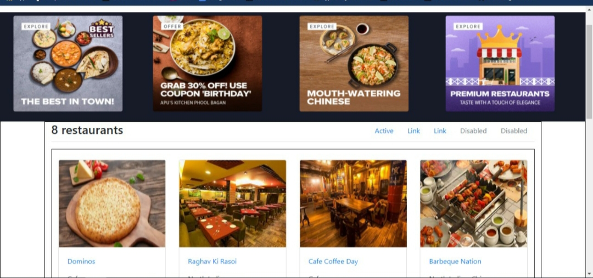
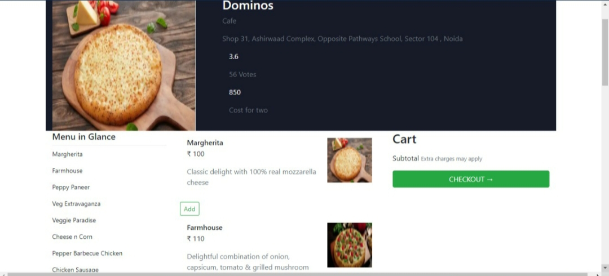
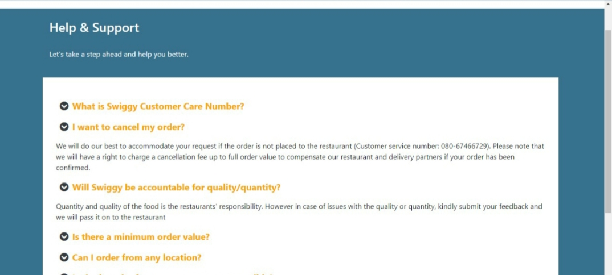

# SWIGGY

<h1 align="center">
    <br>
    
  </h1>

  <h4 align="center">An online food ordering and delivery platform Swiggy clone App</h4>


SWIGGY is an online food ordering and delivery platform :fries: :spaghetti: :pizza: :custard:

### Tech stacks used :
* HTML
* CSS
* BOOTSTRAP
* JAVASCRIPT

## Installation
Clone the App
```
git clone "https://github.com/Gargi-123/masai-sprint-5.git"
```

Install a live server & run it
```
npm run json:server
```

# Screenshots






## Issues / Need changes

- [] GEO location is not working 
- [] Graph/charts are not fetchinng the correct data.
- [] After checkout the payment successfull text is hardcoded.
- [] Search some of the images are not showed in food section.


